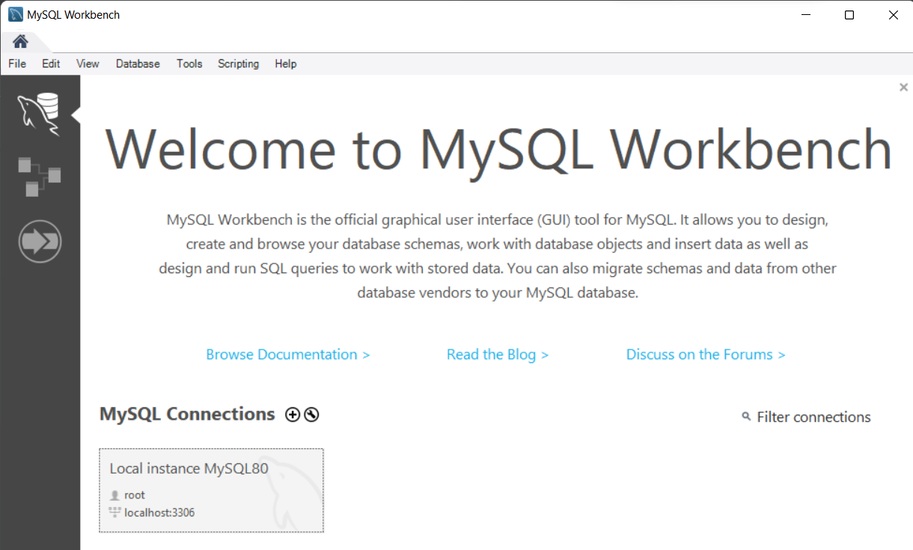
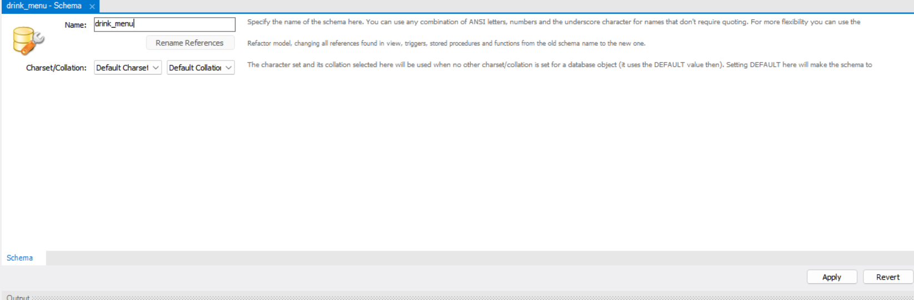
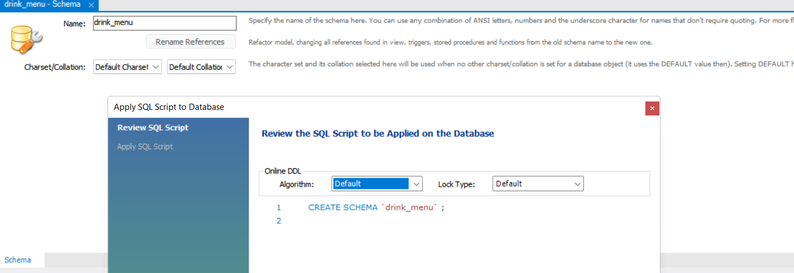
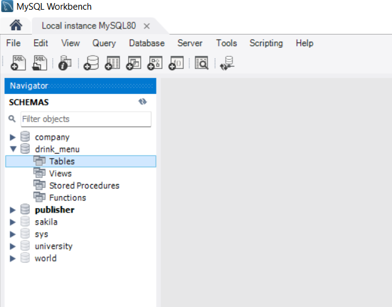
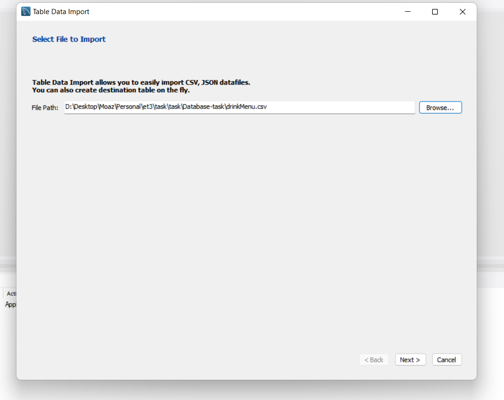
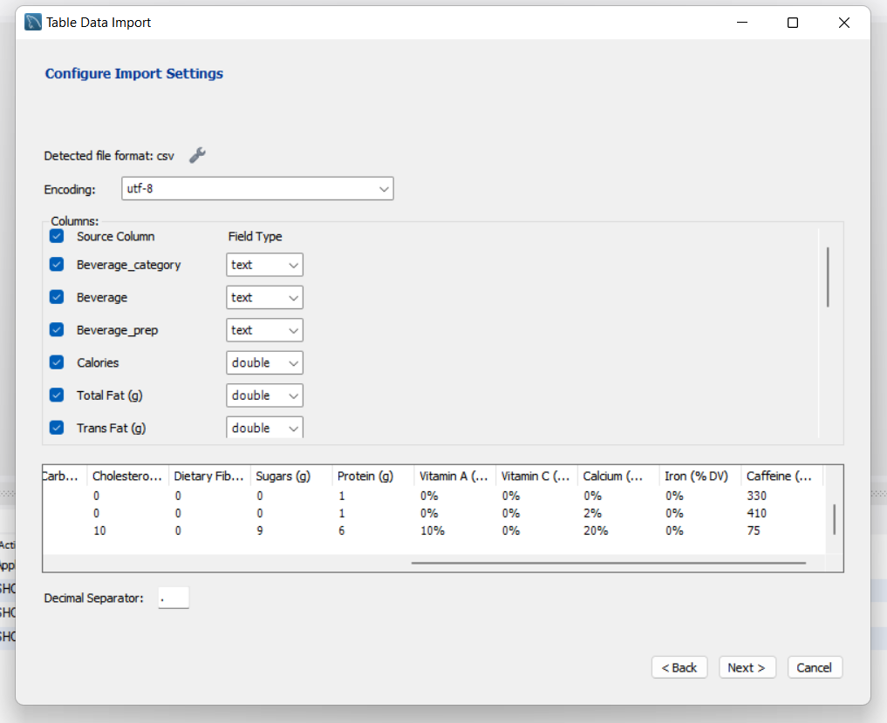
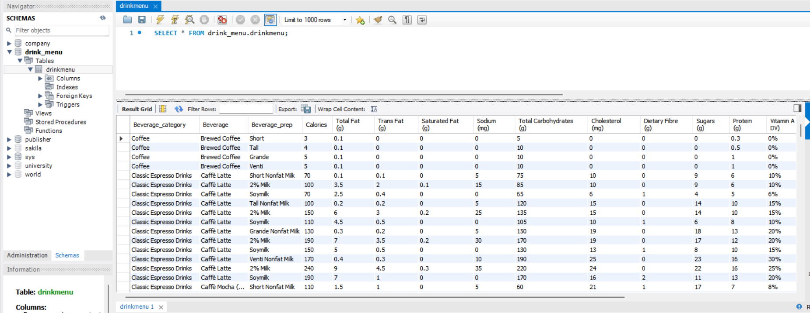
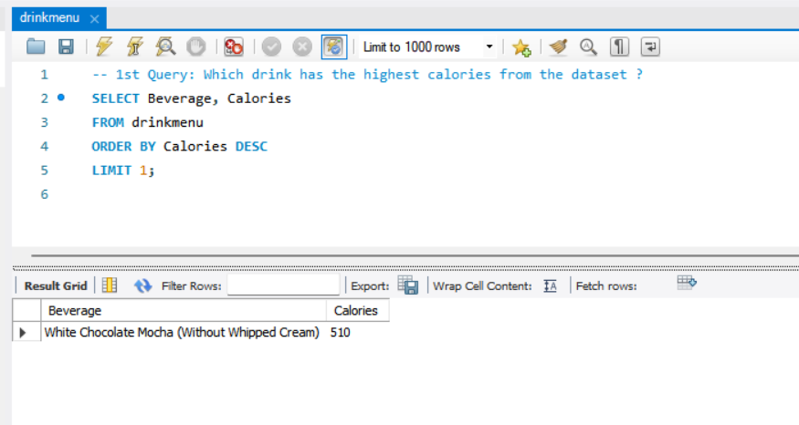
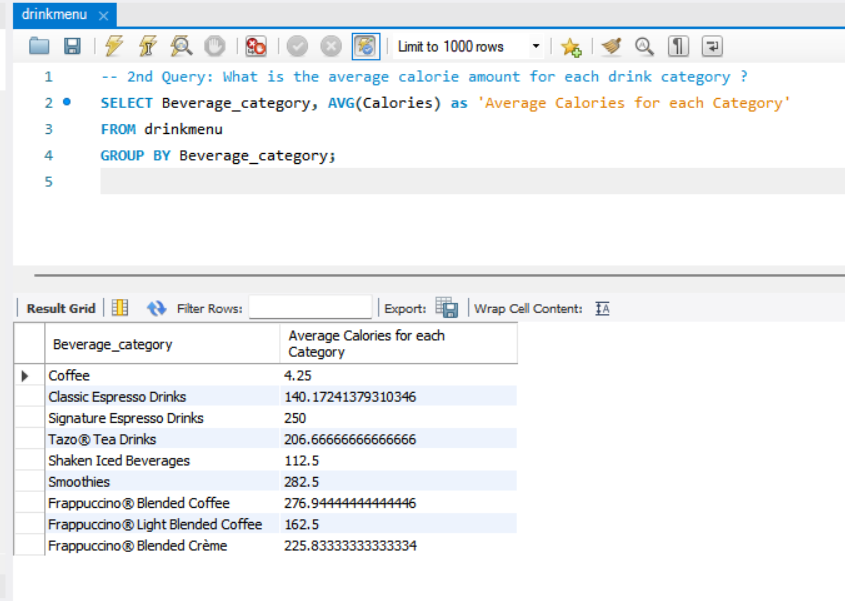
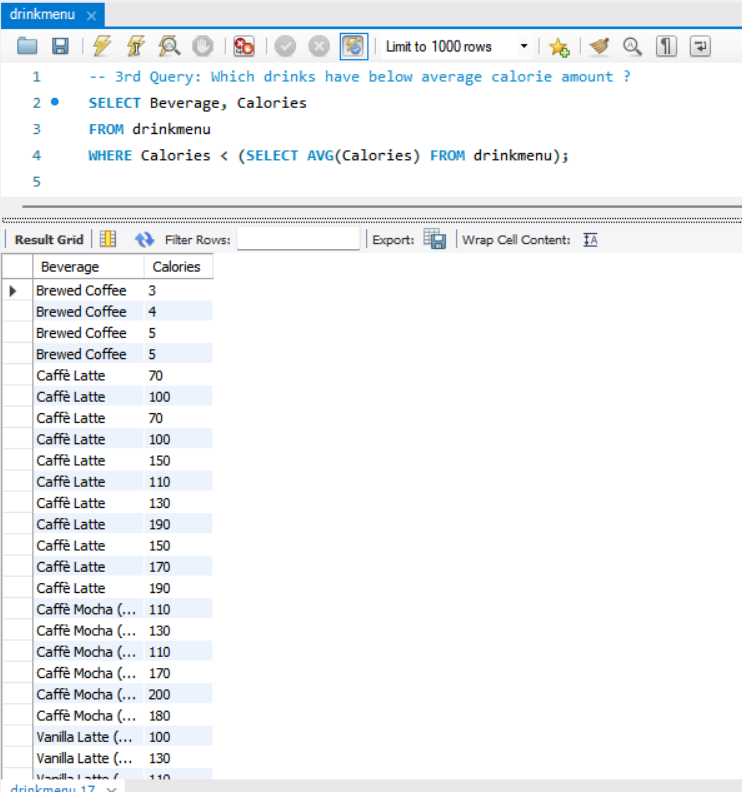

# eT3 Database Task

Database task for eT3 Internship 

## Installation

Use your preferred SQL DBMS (MySQL, PostgreSQL, MS SQL Server). In this task I used MySQL as it is a free source and compatible with most platforms.\
To start using MySQL, Download MySQL Workbench or phpMyAdmin

[MySQL Workbench Download Link](https://dev.mysql.com/downloads/workbench/)\
[phpMyAdmin Download Link](https://www.phpmyadmin.net/downloads/)

## Usage
### Opening MySQL Workbench
#### Open MySQL Workbench

### Create a new Schema for drink menu
\

### Create a new table inside drink menu schema

### Selecting csv file to import it to the new table

### Check for fields type (In our drink menu case, it's better to make numeric values as double instead of int to avoid inaccurate results)

### Final check that data imported successfully

## Queries
### 1st Query: Which drink has the highest calories from the dataset ?

~~~sql
SELECT Beverage, Calories
FROM drinkmenu
ORDER BY Calories DESC
LIMIT 1;
~~~

### 2nd Query: What is the average calorie amount for each drink category ?

~~~sql
SELECT Beverage_category, AVG(Calories) as 'Average Calories for each Category'
FROM drinkmenu
GROUP BY Beverage_category;
~~~

### 3rd Query: Which drinks have below average calorie amount ?

~~~sql
SELECT Beverage, Calories
FROM drinkmenu
WHERE Calories < (SELECT AVG(Calories) FROM drinkmenu);
~~~

